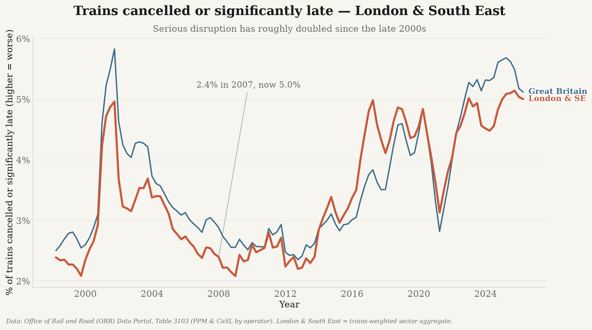
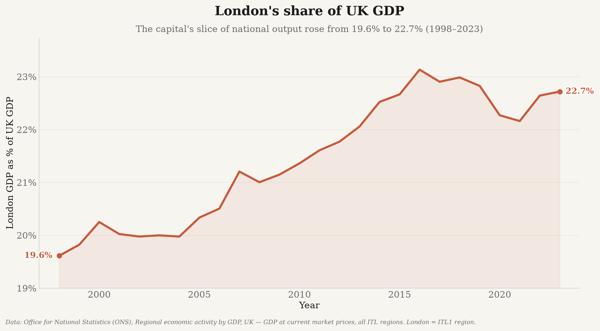

# Social, Economic, and Political Decline in the United Kingdom

A data-driven look at the **United Kingdom's relative decline** across the economy, financial
markets, public services, and society — benchmarked against the US and European peers.

Every analysis is a **self-contained, reproducible pipeline** that pulls **only real,
publicly-sourced data** from official APIs (World Bank, OECD, Eurostat, ONS, UK Home Office,
UN Population Division via the World Bank, Maddison Project Database). **No values are
hand-entered, mocked, interpolated, or synthesised** — each figure traces to a cited source,
and monetary series are inflation-adjusted (real) unless explicitly labelled nominal.

## Analyses

| Analysis | Folder | What it shows |
|---|---|---|
| GDP & incomes | [`europe_data/`](europe_data/README.md) | Real GDP per capita & median incomes: UK vs US/Europe |
| Stock markets | [`markets_data/`](markets_data/README.md) | UK vs US listed-market size (cap, % of GDP, listings) |
| NHS | [`nhs_data/`](nhs_data/README.md) | NHS waiting times & lists across the four nations |
| Tax burden | [`tax/`](tax/README.md) | Tax-to-GDP, tax wedge: UK vs Europe vs US |
| Tuition | [`tuition/`](tuition/README.md) | Cost of a four-year degree: UK vs EU vs US |
| Institutional trust | [`trust_data/`](trust_data/README.md) | Trust in government & governance indicators |
| Migration | [`uk_migration/`](uk_migration/README.md) | UK immigration over time (legal + irregular) |
| Ageing | [`age_data/`](age_data/README.md) | Age structure & median age: UK vs US/Europe |
| London & GDP | [`london_data/`](london_data/README.md) | London's share of UK GDP & GDP-per-head concentration |

All output images live in one place: **[`outputs/`](outputs)**, one subfolder per analysis.

## Key results

**The whole thesis in one image — eight measures at a glance:**


Every panel is tracked from **2007** — the eve of the financial crisis and the UK's high-water
mark on most of these measures — so the eight trends read as one holistic decline. Each measure below in detail.

### GDP per capita — the US pulls away, and even Poland is catching up

In real terms (constant 2015 US$), the UK drew level with the US in 2007 — but the US then
surged to **162% of the UK by 2024**, while **Poland climbed from 9% to 47%** of UK GDP per
capita. *Source: World Bank WDI (NY.GDP.PCAP.CD deflated by US CPI, FP.CPI.TOTL), constant 2015 US$.*

### Stock market — the UK shrinks against the US

UK listed-market capitalisation fell from a peak of **~27% of the US (1990) to ~8% (2022)**,
and the number of UK-listed companies has nearly halved since its 2006 peak.
*Source: World Federation of Exchanges via World Bank WDI.*

### NHS — waiting lists have ballooned, and per-head the smaller nations fare worst

Adjusted for population, the referral-to-treatment waiting list has roughly doubled across all
four nations — and **Wales (251) and Northern Ireland (240 per 1,000) now exceed England (128)**.
*Source: NHS England / Public Health Scotland / StatsWales / DoH Northern Ireland.*

### Rail — London train disruption has climbed back to early-2000s levels

The share of London & South East trains **cancelled or significantly late has roughly doubled** —
from ~2.4% (2007) to ~5% (2024) — even though the lenient headline "on time" measure (PPM) has
stayed broadly flat. *Source: Office of Rail and Road (ORR) Data Portal, Table 3103; London & South
East reconstructed as a trains-weighted sector aggregate (validated against ORR's official sector figure).*

### Tax burden — rising tax-to-GDP

*Source: OECD Revenue Statistics & Taxing Wages.*

### Tuition — a UK degree now costs as much as a US one

UK annual tuition (~$11.4k) now matches the US, while most of the EU remains free.
*Source: Eurydice / NCES / UK fee cap; constant 2022 USD (CPI-adjusted).*

### Institutional trust — confidence in government

*Source: OECD / Gallup World Poll via Our World in Data.*

### Ageing — median age rises

*Source: UN Population Division via World Bank WDI.*

### London — a growing share of UK output

London now produces **~22.7% of all UK GDP** (up from 19.6% in 1998) on ~13% of the
population, and its **GDP per head has widened to ~1.73× the UK average**. Economic activity
has become *more* concentrated in the capital over the past quarter-century.
*Source: ONS, Regional economic activity by GDP (current prices, all ITL regions).*

## Repository layout

```
uk_decline/
  europe_data/   markets_data/   nhs_data/   tax/
  tuition/       trust_data/     uk_migration/   age_data/   rail_data/   london_data/
      └─ each: analysis code + README.md (+ CITATIONS where relevant)
  outputs/       # ALL figures, one subfolder per analysis (tracked; render on GitHub)
    gdp_income/  stock_markets/  nhs/  tax/  tuition/  trust/  migration/  age/  rail/  london/
  data/          # raw / intermediate inputs (git-ignored, regenerable)
  tests/         # test suites
  requirements.txt
```

## Setup

```bash
python3 -m venv .venv
./.venv/bin/pip install -r requirements.txt
```

Each analysis runs as a module from the repo root, e.g.:

```bash
./.venv/bin/python -m europe_data.fetch_data      # fetch data -> data/
./.venv/bin/python -m europe_data.plot_uk_decline # figures -> outputs/gdp_income/
./.venv/bin/python -m markets_data                # UK vs US markets -> outputs/stock_markets/
./.venv/bin/python -m nhs_data                    # NHS -> outputs/nhs/
./.venv/bin/python -m rail_data                   # London rail delays -> outputs/rail/
./.venv/bin/python -m london_data                 # London's share of UK GDP -> outputs/london/
```

See each analysis's README for its exact commands and full source citations.

## Data integrity
No API keys are required, and no data is fabricated. Downloaded raw data lives under `data/`
(git-ignored, regenerable); the curated, citation-bearing figures under `outputs/` are the
committed showcase. Values have been spot-checked against the live official APIs.
