# Social, Economic, and Political Decline in the United Kingdom

A data-driven look at the **United Kingdom's relative decline** across the economy, financial
markets, public services, and society — benchmarked against the US and European peers.

Every analysis is a **self-contained, reproducible pipeline** using **real,
publicly-sourced data** from official APIs and cited primary-source tables (World Bank,
OECD, Eurostat, ONS, UK Home Office, UN Population Division, Maddison Project Database).
Some unavailable machine-readable tables are transcribed into curated source rows with
row-level citations; no values are mocked, interpolated, or synthesised. Monetary series
are inflation-adjusted (real) unless explicitly labelled nominal.

## Analyses

| Analysis | Folder | What it shows |
|---|---|---|
| GDP & incomes | [`europe_data/`](europe_data/README.md) | Real GDP per capita & median incomes: UK vs US/Europe |
| Stock markets | [`markets_data/`](markets_data/README.md) | UK vs US listed-market size (cap, % of GDP, listings) |
| Austerity | [`austerity_data/`](austerity_data/README.md) | Real public-service spending cuts and public investment after 2010 |
| Food banks | [`foodbank_data/`](foodbank_data/README.md) | Emergency food parcels distributed by the Trussell network |
| Sterling | [`sterling_data/`](sterling_data/README.md) | How much foreign currency £1 buys against major currencies |
| Trade openness | [`trade_data/`](trade_data/README.md) | Exports plus imports as a percentage of GDP |
| NHS | [`nhs_data/`](nhs_data/README.md) | NHS waiting times & lists across the four nations |
| Tax burden | [`tax/`](tax/README.md) | Tax-to-GDP, tax wedge: UK vs Europe vs US |
| Tuition | [`tuition/`](tuition/README.md) | Cost of a four-year degree: UK vs EU vs US |
| Institutional trust | [`trust_data/`](trust_data/README.md) | Trust in government & governance indicators |
| Migration | [`uk_migration/`](uk_migration/README.md) | UK immigration over time (legal + irregular) |
| Ageing | [`age_data/`](age_data/README.md) | Age structure & median age: UK vs US/Europe |
| London & GDP | [`london_data/`](london_data/README.md) | London's share of UK GDP & GDP-per-head concentration |
| Crime | [`crime_data/`](crime_data/README.md) | Long-run crime trend (CSEW) & homicide vs peers |
| PPP (alternative lens) | [`ppp_data/`](ppp_data/README.md) | The same decline measured at purchasing power parity |

All output images live in one place: **[`outputs/`](outputs)**, one subfolder per analysis.

## Key results

**Eight of the clearest economic and social pressure points at a glance:**


Each panel uses the earliest comparable observation appropriate to that official series.
The selection emphasizes living standards, public services, state capacity, hardship,
institutions, and changing crime patterns.

### GDP per capita — the US pulls away, and even Poland is catching up
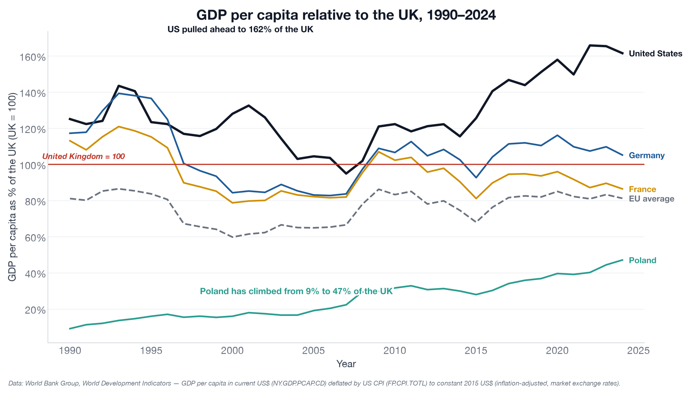
In real terms (constant 2015 US$), the UK drew level with the US in 2007 — but the US then
surged to **162% of the UK by 2024**, while **Poland climbed from 9% to 47%** of UK GDP per
capita. *Source: World Bank WDI (NY.GDP.PCAP.CD deflated by US CPI, FP.CPI.TOTL), constant 2015 US$.*

### Stock market — the UK shrinks against the US
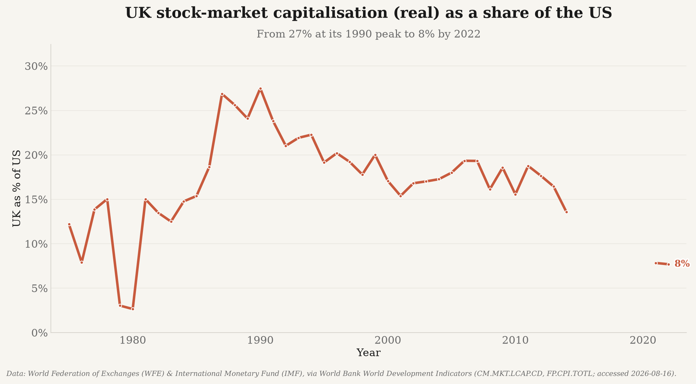
UK listed-market capitalisation fell from a peak of **~27% of the US (1990) to ~8% (2022)**,
and the number of UK-listed companies has nearly halved since its 2006 peak.
*Source: World Federation of Exchanges via World Bank WDI.*

### Austerity — the headline total hid deep cuts to services and investment
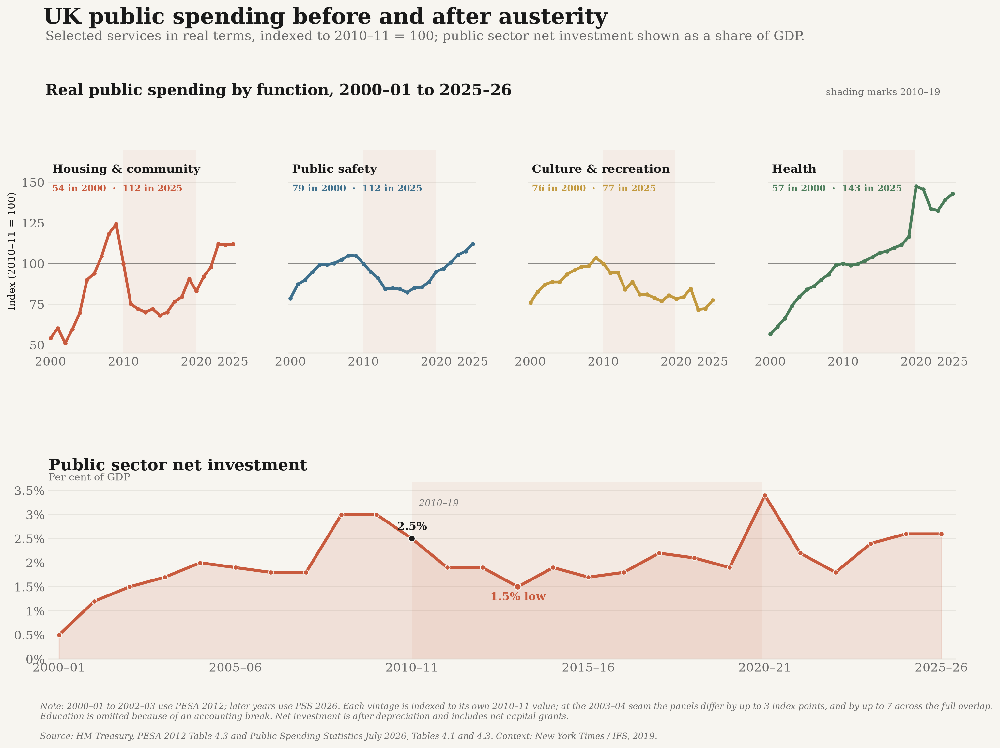
Real spending did not fall evenly after 2010. **Housing and community amenities fell by about
one-third at the trough**, culture and public safety also contracted sharply, while health was
protected. Public sector net investment fell from **2.5% of GDP in 2010–11 to 1.5% in
2013–14**. *Source: HM Treasury Public Spending Statistics, July 2026, Tables 4.1 and 4.3.*

### Food banks — emergency parcel use remains far above its pre-pandemic level
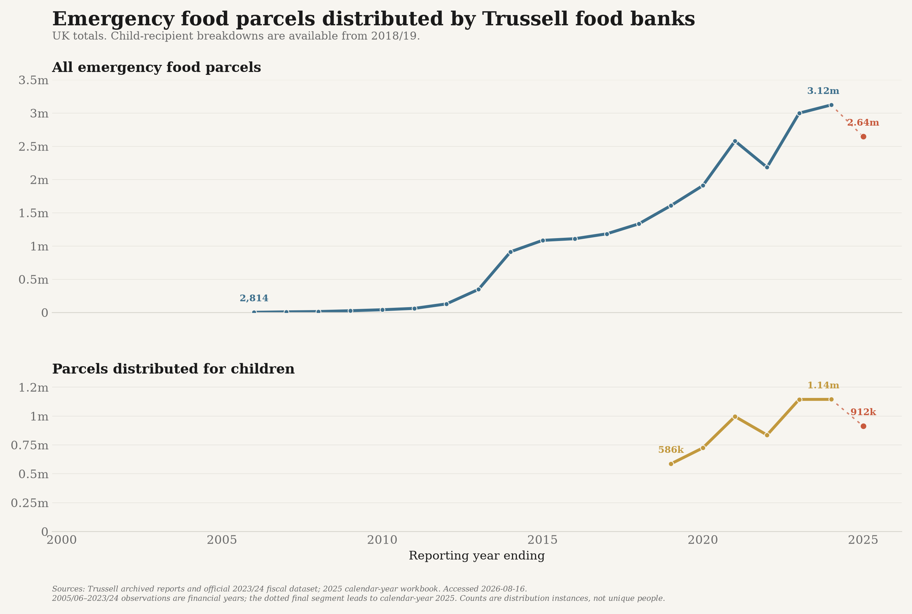
Food banks in Trussell's UK community distributed **2.64 million emergency food parcels in
2025**. That was down 12% from 2024 and 18% below the 2023 peak, but still **45% above
2019**. Parcels measure supplies distributed, not unique people, and exclude independent food
banks. *Source: Trussell end-of-year statistics and official 2025 parcel workbook.*

### Sterling — how much foreign currency one pound buys
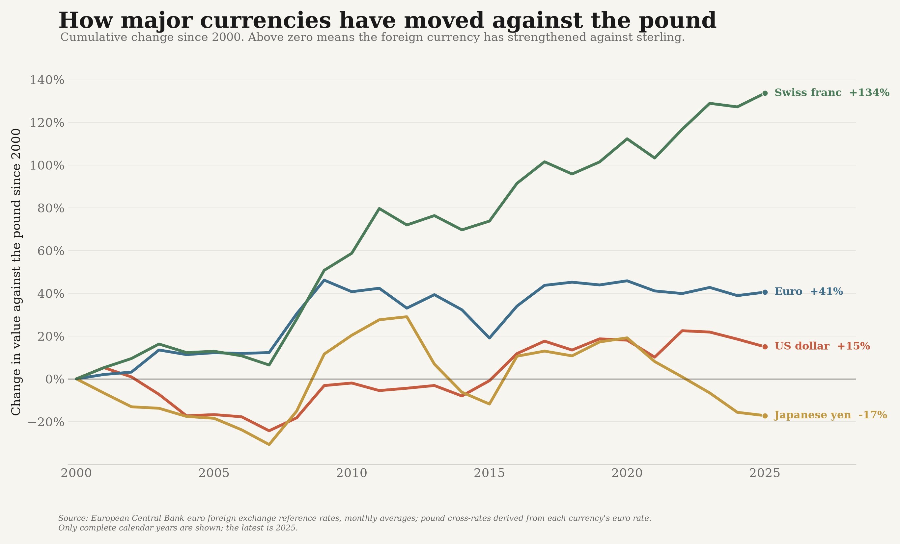
The chart shows the cumulative change in the dollar, euro, yen, and Swiss franc
**against the pound since 2000**. Positive values mean the foreign currency strengthened
against sterling. *Source: European Central Bank reference exchange rates.*

### Trade — how much of the economy crosses borders?
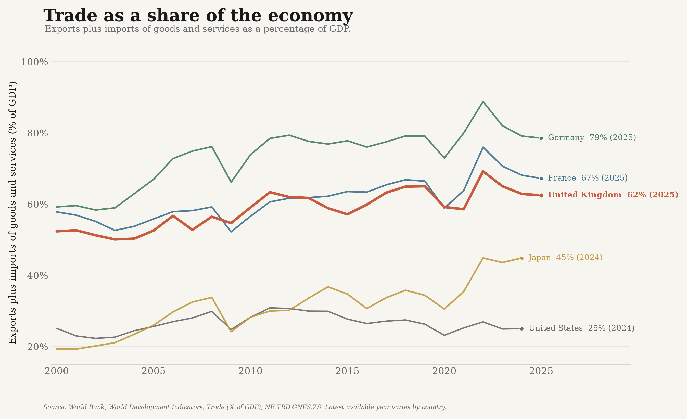
Trade—exports plus imports of goods and services—accounts for roughly **62% of UK GDP**
in the latest observation. The chart compares the UK with Germany, France, Japan, and
the United States. *Source: World Bank WDI, NE.TRD.GNFS.ZS.*

### NHS — waiting lists have ballooned, and per-head the smaller nations fare worst
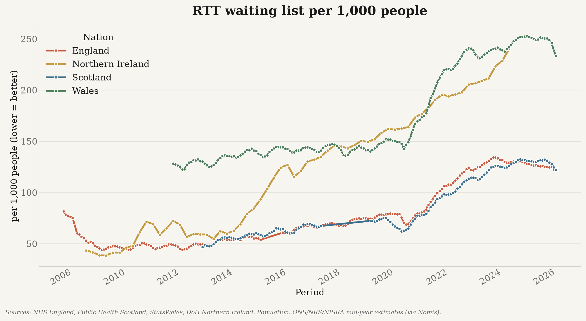
Adjusted for population, the referral-to-treatment waiting list has roughly doubled across all
four nations; the latest rates are **240 per 1,000 in Northern Ireland, 233 in Wales, and 123 in England**.
*Source: NHS England / Public Health Scotland / StatsWales / DoH Northern Ireland.*

### Rail — London train disruption has climbed back to early-2000s levels
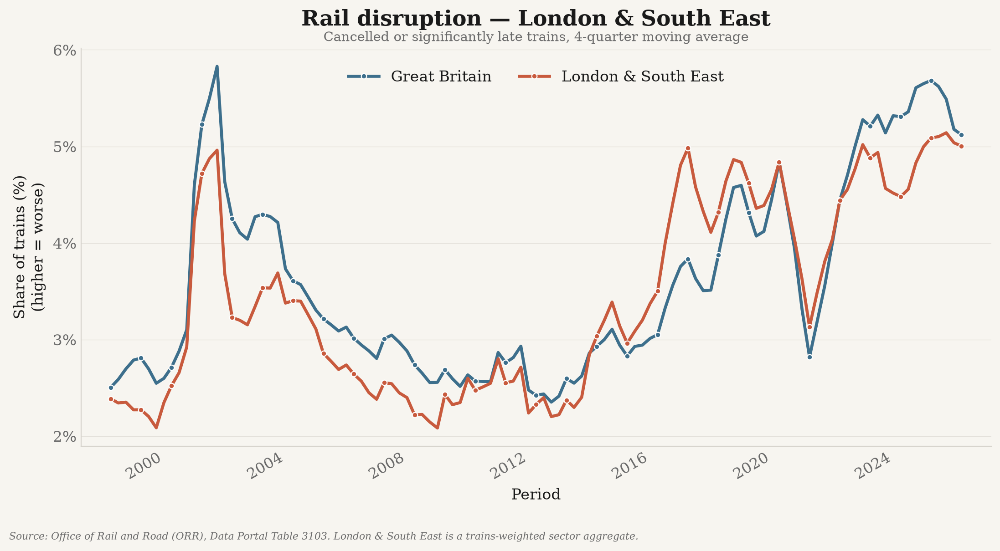
The share of London & South East trains **cancelled or significantly late has roughly doubled** —
from ~2.4% (2007) to ~5% (2025) — even though the lenient headline "on time" measure (PPM) has
stayed broadly flat. *Source: Office of Rail and Road (ORR) Data Portal, Table 3103; London & South
East reconstructed as a trains-weighted sector aggregate (validated against ORR's official sector figure).*

### Tax burden — rising tax-to-GDP
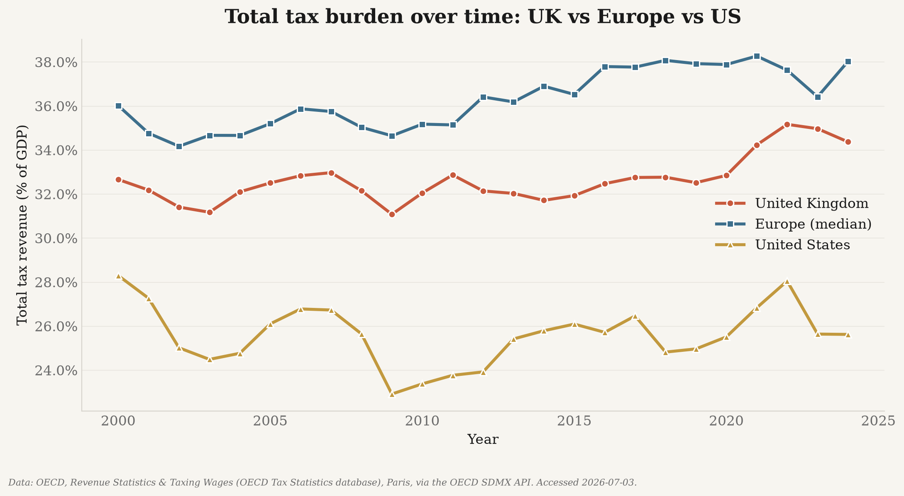
*Source: OECD Revenue Statistics & Taxing Wages.*

### Tuition — England now costs more than US public tuition
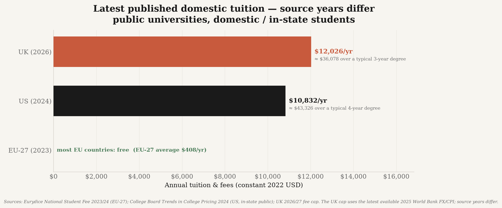
The latest fully observed English cap is **~$11.0k in constant 2022 dollars (2024)**,
above the latest US public tuition observation (~$10.8k), while most of the EU remains
free. Higher published caps are excluded from the real history until same-year FX and
CPI exist.
*Source: Eurydice / NCES / UK fee cap; constant 2022 USD (CPI-adjusted).*

### Institutional trust — confidence in government
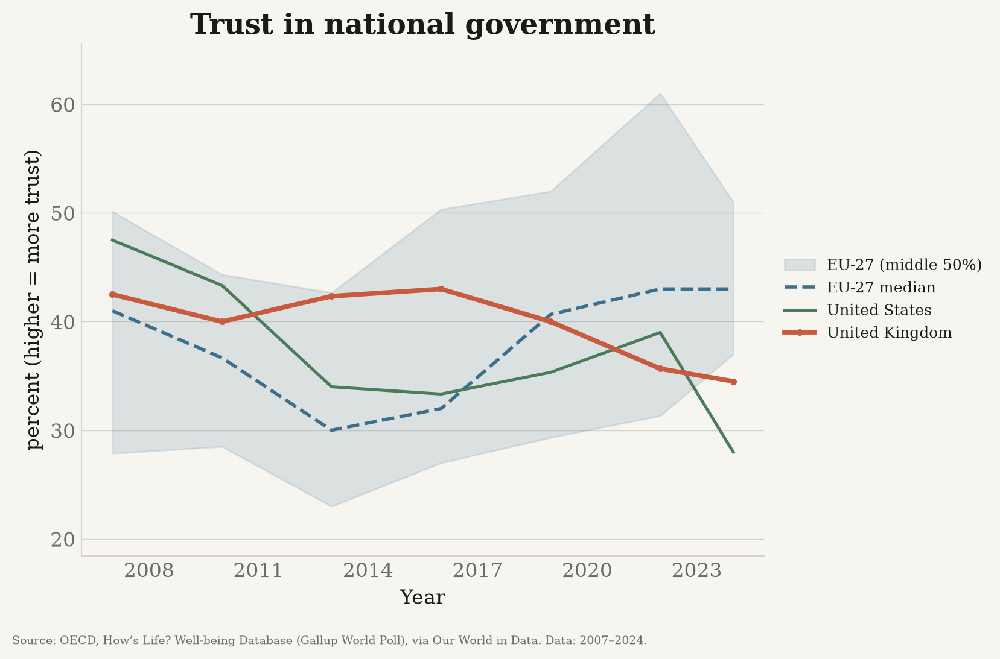
*Source: OECD / Gallup World Poll via Our World in Data.*

### Ageing — median age rises
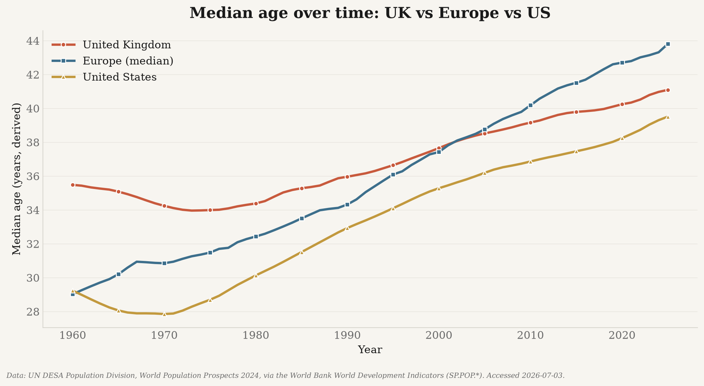
*Source: UN Population Division via World Bank WDI.*

### London — a growing share of UK output
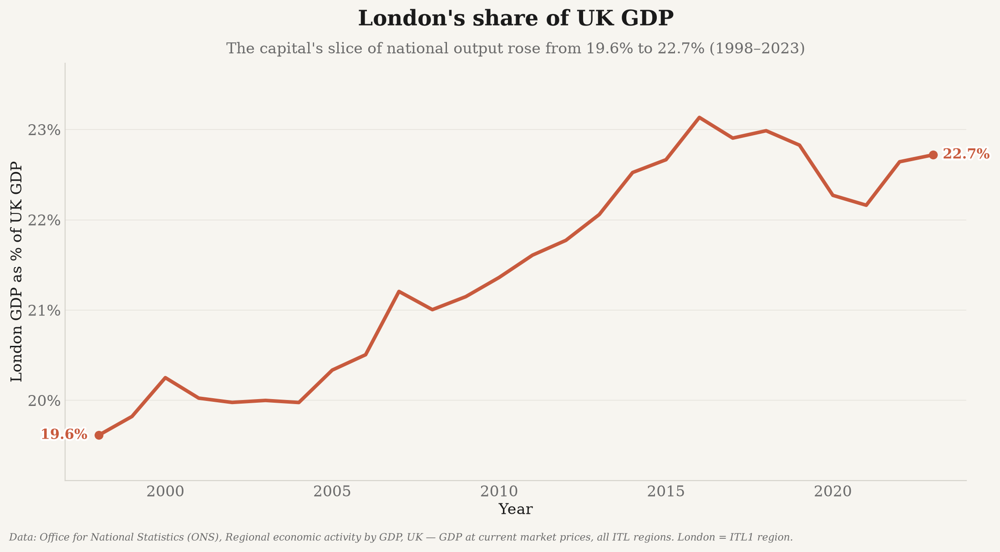
London now produces **~22.7% of all UK GDP** (up from 19.6% in 1998) on ~13% of the
population, and its **GDP per head has widened to ~1.73× the UK average**. Economic activity
has become *more* concentrated in the capital over the past quarter-century.
*Source: ONS, Regional economic activity by GDP (current prices, all ITL regions).*

### Crime — the fall is real, but crime has shifted online
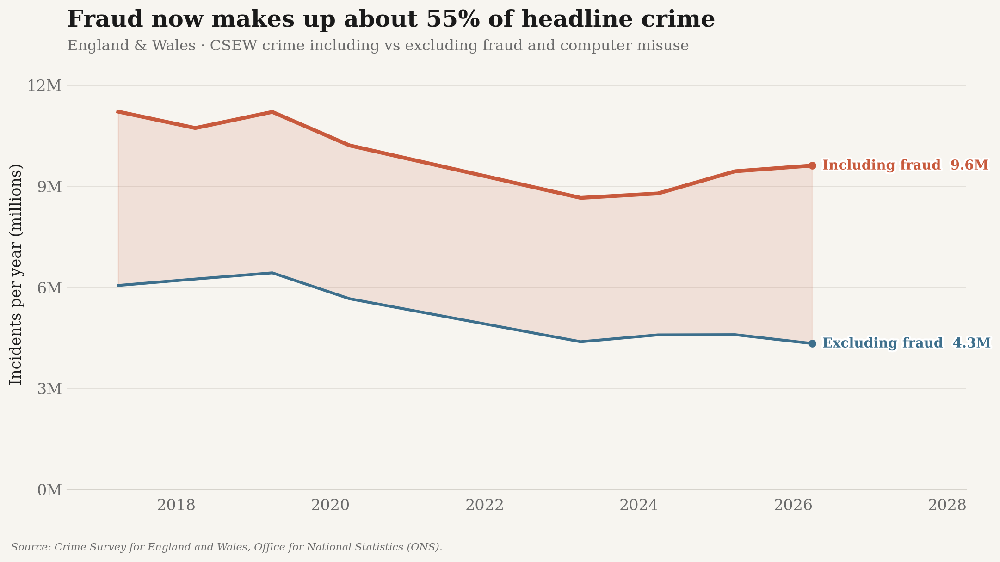
Traditional victim-based crime has **fallen dramatically** — from a **19.8M** peak (1995) to
**~4.3M** incidents (2026) on the Crime Survey for England & Wales. But once **fraud and
computer misuse** are counted (measured from 2017), total crime is **~9.6M — roughly double**
the headline, i.e. crime has largely **moved online** rather than disappeared. On homicide,
the most comparable international measure, the UK (~1.1 per 100k) sits **far below the US
(~5.8)** and around its European peers. *Source: ONS Crime Survey for England & Wales;
UN Office on Drugs and Crime (UNODC) via World Bank WDI.*

### Purchasing power parity — how much of the decline is the exchange rate?

Every monetary series above is measured at **market exchange rates**. Converting at
**purchasing power parity** instead — what UK output buys *at home* rather than on world
markets — qualifies the headline GDP result without overturning it. Of the UK's 41-point fall
against the US since 2007, **29 points are prices and the exchange rate, and 13 points are
genuinely lost output**.

So roughly 70% of the measured decline is currency rather than production — but the remaining
30% is real, and the UK's post-2007 slowdown is the worst of its peers: real output per head
grew **0.42% a year** against the US's **1.27%**. A weaker pound also genuinely makes imports
and energy dearer. The story moves from *"Britain stopped producing"* to *"Britain grew slowly
**and** its output lost value against the world"*. The measures where currency cancels
entirely point the same way — Poland has reached **84% of UK GDP per head at PPP**, and UK
tuition took **24% of GDP per capita against 12% in the US** in 2022. See [`ppp_data/`](ppp_data/README.md) for the full parallel set, the method,
and the caveats. *Source: World Bank WDI (NY.GDP.PCAP.CD, NY.GDP.PCAP.PP.KD), ICP 2021 benchmark.*

## Repository layout

```
uk_decline/
  europe_data/   markets_data/   austerity_data/   foodbank_data/   sterling_data/
  trade_data/
  nhs_data/      tax/
  tuition/       trust_data/     uk_migration/   age_data/   rail_data/   london_data/
  crime_data/    ppp_data/
      └─ each: analysis code + README.md (+ CITATIONS where relevant)
  vizstyle/      # shared "Substack" plotting house style (palette + rcParams + helpers)
  outputs/       # ALL figures, one subfolder per analysis (tracked; render on GitHub)
    gdp_income/  stock_markets/  austerity/  food_banks/  sterling/  trade/  nhs/  tax/  tuition/  trust/  migration/  age/  rail/  london/  crime/  ppp/
  data/          # raw / intermediate inputs (git-ignored, regenerable)
  tests/         # test suites
  requirements.txt
```

## Setup

```bash
python3 -m venv .venv
./.venv/bin/pip install -r requirements.txt
```

Each analysis runs as a module from the repo root, e.g.:

```bash
./.venv/bin/python -m europe_data.fetch_data      # fetch data -> data/
./.venv/bin/python -m europe_data.plot_uk_decline # figures -> outputs/gdp_income/
./.venv/bin/python -m markets_data                # UK vs US markets -> outputs/stock_markets/
./.venv/bin/python -m austerity_data              # austerity -> outputs/austerity/
./.venv/bin/python -m foodbank_data               # food-bank use -> outputs/food_banks/
./.venv/bin/python -m sterling_data               # pound exchange rates -> outputs/sterling/
./.venv/bin/python -m trade_data                  # trade share of GDP -> outputs/trade/
./.venv/bin/python -m nhs_data                    # NHS -> outputs/nhs/
./.venv/bin/python -m rail_data                   # London rail delays -> outputs/rail/
./.venv/bin/python -m london_data                 # London's share of UK GDP -> outputs/london/
./.venv/bin/python -m crime_data                  # crime trend & homicide -> outputs/crime/
./.venv/bin/python -m ppp_data                    # PPP alternative view -> outputs/ppp/
```

See each analysis's README for its exact commands and full source citations.

## Data integrity
No API keys are required, and no data is fabricated. Downloaded raw data lives under `data/`
(git-ignored, regenerable); the curated, citation-bearing figures under `outputs/` are the
committed showcase. Values have been spot-checked against the live official APIs.
