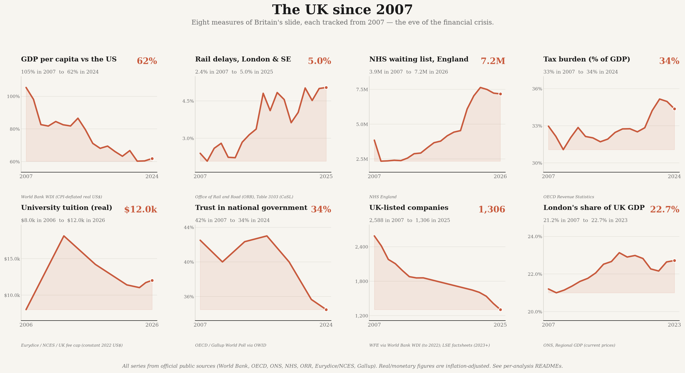

<div align="center">
  <h1>Social, Economic, and Political Change in the United Kingdom</h1>
  <p><strong>Official data. Reproducible analysis. Long-run context.</strong></p>
  <p>Comparing the UK with the United States and European peers.</p>
  <p>
    <a href="#uk-since-2007">Overview</a> ·
    <a href="#explore-the-evidence">Analyses</a> ·
    <a href="#setup">Setup</a>
  </p>
</div>

---

## UK since 2007

The overview combines eight comparable official series. It uses 2007 as the common framing;
each panel uses the nearest appropriate baseline available from its source.

<p align="center">
  
</p>

## Explore the evidence

**Economy and living standards:** [GDP and incomes](europe_data/README.md),
[stock markets](markets_data/README.md), [sterling](sterling_data/README.md),
[trade](trade_data/README.md), [London's economy](london_data/README.md), and
[purchasing power parity](ppp_data/README.md).

**Public services and infrastructure:** [austerity](austerity_data/README.md),
[NHS performance](nhs_data/README.md), and [rail performance](rail_data/README.md).

**Household pressure:** [tax](tax/README.md), [tuition](tuition/README.md), and
[food-bank use](foodbank_data/README.md).

**Population and institutions:** [migration](uk_migration/README.md),
[ageing](age_data/README.md), [crime](crime_data/README.md), and
[institutional trust](trust_data/README.md).

Each analysis is a self-contained pipeline with its own methodology, caveats, charts, and
primary-source citations. The complete figure collection is in [`outputs/`](outputs).

## Setup

```bash
python3 -m venv .venv
./.venv/bin/pip install -r requirements.txt
```

Each analysis runs as a module from the repo root, e.g.:

```bash
./.venv/bin/python -m europe_data.fetch_data      # fetch data -> data/
./.venv/bin/python -m europe_data.plot_uk_decline # figures -> outputs/gdp_income/
./.venv/bin/python -m markets_data                # UK vs US markets -> outputs/stock_markets/
./.venv/bin/python -m austerity_data              # austerity -> outputs/austerity/
./.venv/bin/python -m foodbank_data               # food-bank use -> outputs/food_banks/
./.venv/bin/python -m sterling_data               # pound exchange rates -> outputs/sterling/
./.venv/bin/python -m trade_data                  # trade share of GDP -> outputs/trade/
./.venv/bin/python -m nhs_data                    # NHS -> outputs/nhs/
./.venv/bin/python -m rail_data                   # London rail delays -> outputs/rail/
./.venv/bin/python -m london_data                 # London's share of UK GDP -> outputs/london/
./.venv/bin/python -m crime_data                  # crime trend & homicide -> outputs/crime/
./.venv/bin/python -m ppp_data                    # PPP alternative view -> outputs/ppp/
```

See each analysis's README for its exact commands and full source citations.

## Data integrity
No API keys are required, and no data is fabricated. Downloaded raw data lives under `data/`
(git-ignored, regenerable); the curated, citation-bearing figures under `outputs/` are the
committed showcase. Values have been spot-checked against the live official APIs.
