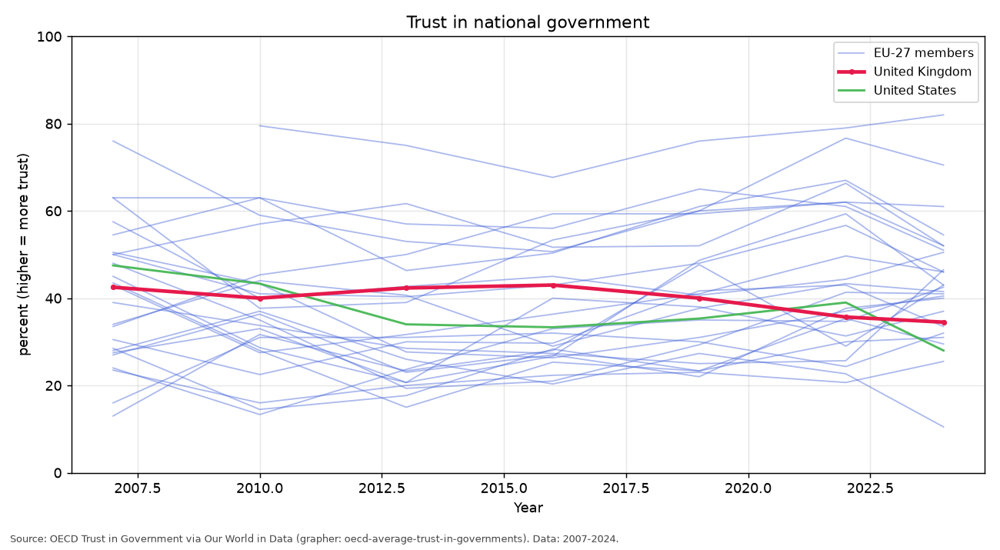
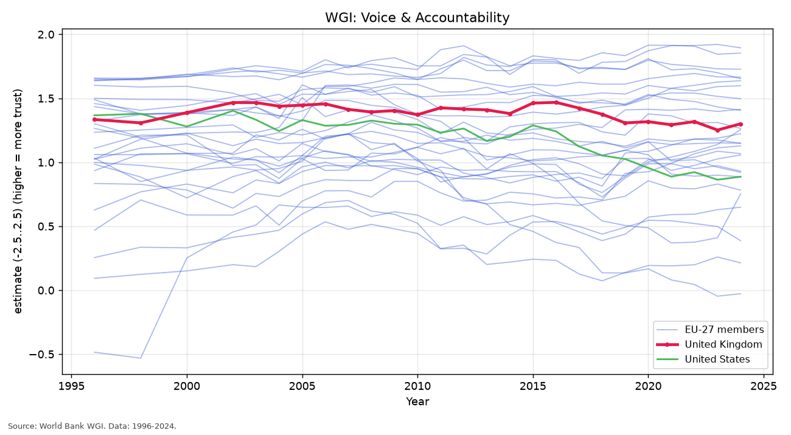
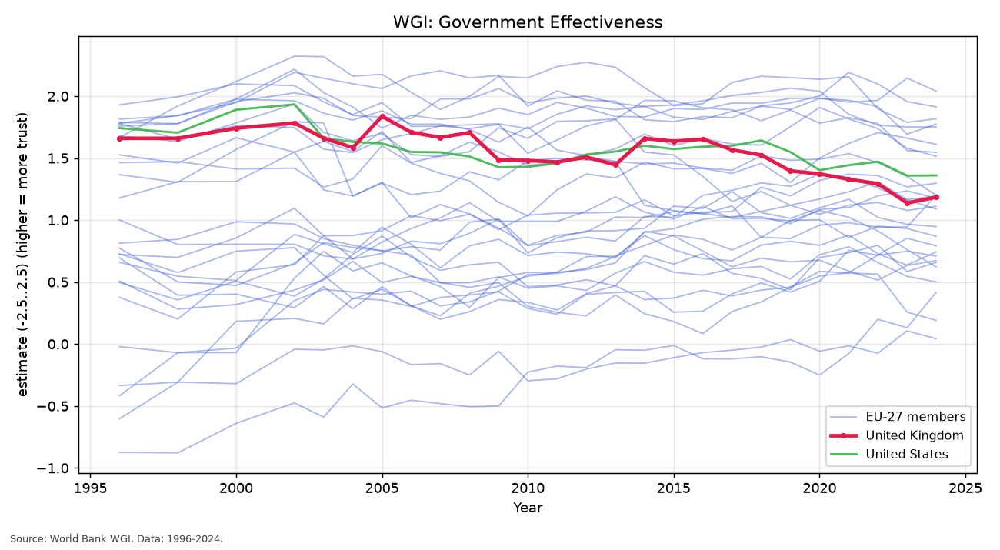
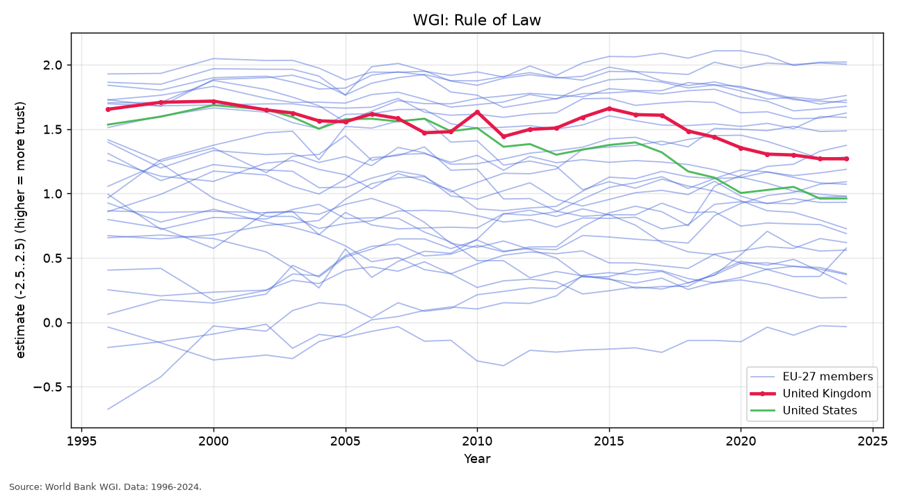
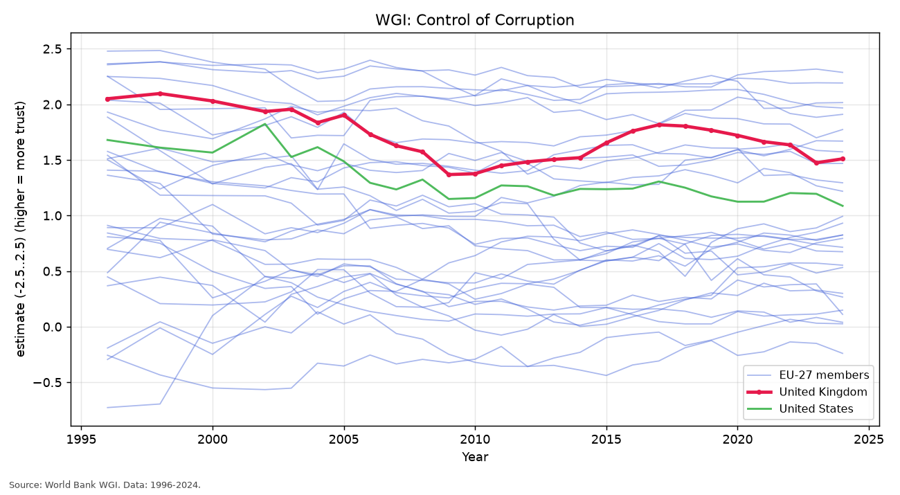

# Trust in UK government over time — data & figures

UK-first with EU-27 + US comparators. Generated by [`fetch_trust.py`](../../fetch_trust.py); see [`trust_data/README.md`](../../trust_data/README.md) for full method notes.

**Coverage:** 1996–2024 · **3203 rows** · 29 countries.

## Data sources & citations

Every value is fetched from, or traceable to, the sources below — credited to the organisation that collected the data. Nothing is hand-authored or estimated. Each figure also prints a short citation as a caption.

- OECD (2026), with major processing by Our World in Data. “OECD average trust in governments” [dataset]. Original data: OECD, *How’s Life? Well-being Database* — survey item from the Gallup World Poll (“In this country, do you have confidence in national government, or not?”). https://ourworldindata.org/grapher/oecd-average-trust-in-governments
- Kaufmann, Daniel & Aart C. Kraay (2024). “The Worldwide Governance Indicators: Methodology and 2024 Update.” Policy Research Working Paper. Washington, DC: World Bank Group. Dataset: *Worldwide Governance Indicators (WGI)*, 2024 update, World Bank Group, Washington, DC — accessed via the World Bank API (DataBank source 3). https://www.govindicators.org

## Figures

### Trust in national government

*Share of people who report they trust the national government (OECD, based on the Gallup World Poll question on confidence in national government).*

- **Unit:** percent (higher = more trust) · **Coverage:** 2007–2024
- **Source:** OECD (2026), with major processing by Our World in Data. “OECD average trust in governments” [dataset]. Original data: OECD, *How’s Life? Well-being Database* — survey item from the Gallup World Poll (“In this country, do you have confidence in national government, or not?”). https://ourworldindata.org/grapher/oecd-average-trust-in-governments

### WGI: Voice & Accountability

*Perceptions of the extent to which citizens can participate in selecting their government, plus freedom of expression, association and a free media (World Bank WGI, governance estimate).*

- **Unit:** estimate (-2.5..2.5) (higher = more trust) · **Coverage:** 1996–2024
- **Source:** Kaufmann, Daniel & Aart C. Kraay (2024). “The Worldwide Governance Indicators: Methodology and 2024 Update.” Policy Research Working Paper. Washington, DC: World Bank Group. Dataset: *Worldwide Governance Indicators (WGI)*, 2024 update, World Bank Group, Washington, DC — accessed via the World Bank API (DataBank source 3). https://www.govindicators.org

### WGI: Government Effectiveness

*Perceptions of the quality of public and civil services, policy formulation/implementation, and the credibility of the government's commitment to such policies (World Bank WGI).*

- **Unit:** estimate (-2.5..2.5) (higher = more trust) · **Coverage:** 1996–2024
- **Source:** Kaufmann, Daniel & Aart C. Kraay (2024). “The Worldwide Governance Indicators: Methodology and 2024 Update.” Policy Research Working Paper. Washington, DC: World Bank Group. Dataset: *Worldwide Governance Indicators (WGI)*, 2024 update, World Bank Group, Washington, DC — accessed via the World Bank API (DataBank source 3). https://www.govindicators.org

### WGI: Rule of Law

*Perceptions of confidence in and adherence to the rules of society - contract enforcement, property rights, the police and the courts (World Bank WGI).*

- **Unit:** estimate (-2.5..2.5) (higher = more trust) · **Coverage:** 1996–2024
- **Source:** Kaufmann, Daniel & Aart C. Kraay (2024). “The Worldwide Governance Indicators: Methodology and 2024 Update.” Policy Research Working Paper. Washington, DC: World Bank Group. Dataset: *Worldwide Governance Indicators (WGI)*, 2024 update, World Bank Group, Washington, DC — accessed via the World Bank API (DataBank source 3). https://www.govindicators.org

### WGI: Control of Corruption

*Perceptions of the extent to which public power is exercised for private gain, including petty and grand corruption and state capture (World Bank WGI).*

- **Unit:** estimate (-2.5..2.5) (higher = more trust) · **Coverage:** 1996–2024
- **Source:** Kaufmann, Daniel & Aart C. Kraay (2024). “The Worldwide Governance Indicators: Methodology and 2024 Update.” Policy Research Working Paper. Washington, DC: World Bank Group. Dataset: *Worldwide Governance Indicators (WGI)*, 2024 update, World Bank Group, Washington, DC — accessed via the World Bank API (DataBank source 3). https://www.govindicators.org

## Files in this folder

- `trust_combined_long.csv` / `trust_combined_wide.csv` — tidy data tables
- `manifest.json` — run metadata (row counts, year span, source list)
- `raw/manual_trust.csv` — OECD survey seed (verbatim from Our World in Data)
- `charts/*.png` — the figures above
- `processed/trust_summary.csv` — UK trend summary
