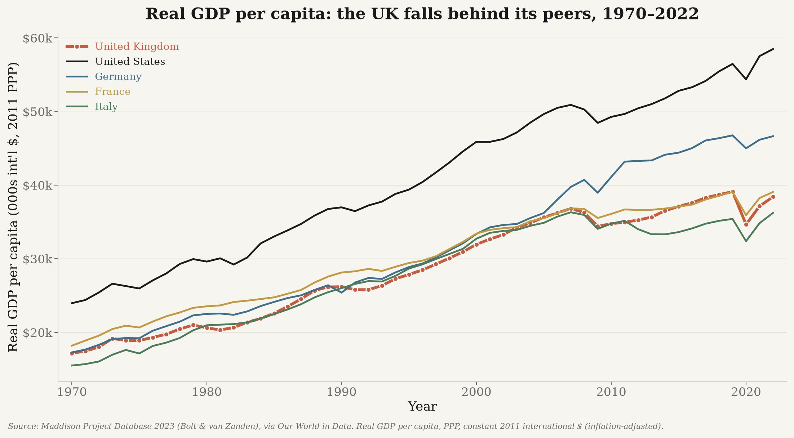
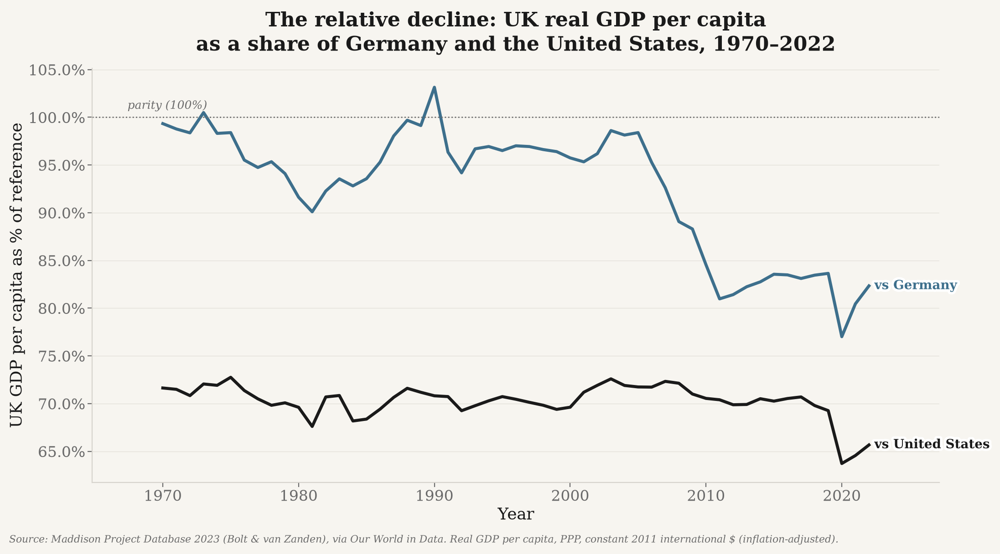
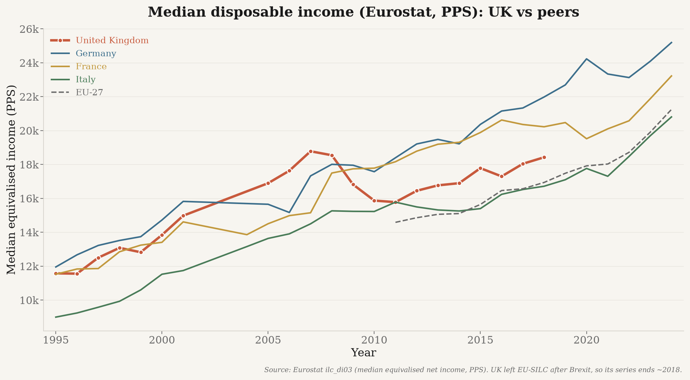
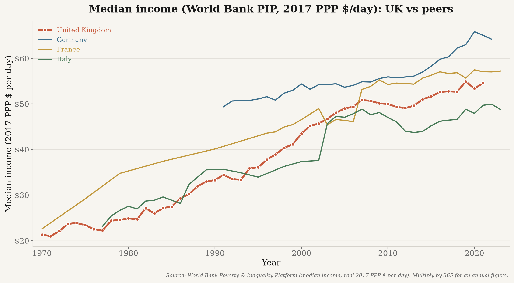

# europe_data — UK GDP per capita & median income (real, PPP)

Reproducible pipeline documenting the **UK's relative economic decline** vs. the US and
European peers, using **only real, publicly-sourced data** (every value is fetched live
from an official API — nothing is hand-entered, mocked, interpolated, or synthesized).

## Headline results (figures in [`../outputs/`](../outputs))

### Real GDP per capita, 1970–2022 (inflation-adjusted)


UK real GDP per capita sits well below the US throughout, converges with France/Italy, and
falls further behind Germany after 2007.
*Source: Maddison Project Database 2023 (Bolt & van Zanden), via Our World in Data — real
GDP per capita, PPP, constant 2011 international $ (inflation-adjusted).*

### The relative decline


UK real GDP per capita fell from **99.3% of Germany's in 1970 to 82.3% in 2022**, and from
**71.6% to 65.7% of the US**.
*Source: Maddison Project Database 2023, via Our World in Data.*

### Median disposable income (a "typical household" measure)



*Sources: Eurostat `ilc_di03` (median equivalised net income, PPS; UK ends ~2018 post-Brexit);
World Bank Poverty & Inequality Platform (real median income, 2017 PPP $/day; UK to ~2021).*

## Data sources (all free, no API key — verified live)

| Metric (column) | Source & citation | Endpoint | Inflation basis |
|---|---|---|---|
| `gdp_per_capita_real_maddison` | **Maddison Project Database 2023** (Bolt & van Zanden), via Our World in Data | `ourworldindata.org/grapher/gdp-per-capita-maddison.csv?csvType=full` | **Real** — constant 2011 international $ (PPP), inflation-adjusted |
| `gdp_per_capita_ppp_current` | **World Bank WDI** `NY.GDP.PCAP.PP.CD` | `api.worldbank.org/v2/country/{iso3}/indicator/{id}` | Nominal — current international $ (kept for reference only; **not plotted**) |
| `gdp_per_capita_ppp_constant` | **World Bank WDI** `NY.GDP.PCAP.PP.KD` | (same) | Real — constant 2021 international $ |
| `median_disposable_income` / `mean_disposable_income` | **Eurostat** `ilc_di03` (`MED_EI`/`MEAN_EI`, `unit=PPS`) | `ec.europa.eu/eurostat/api/dissemination/…/ilc_di03` | Current PPS (cross-country comparable; **not** deflated over time) |
| `median_income_pip` | **World Bank PIP** (Poverty & Inequality Platform) | `api.worldbank.org/pip/v1/pip` | **Real** — constant 2017 PPP $ per day |

**Why Maddison for the long-run GDP chart?** The World Bank PPP series starts only in **1990**;
Maddison provides continuous annual **real** GDP per capita back to the 1970s (and earlier),
which is what lets the comparison reach 1970 while staying inflation-adjusted.

**Countries plotted:** United Kingdom (focus), **United States**, Germany, France, Italy.
(Spain is still fetched into the dataset but is not plotted.)

## Setup & usage

```bash
python3 -m venv .venv && ./.venv/bin/pip install -r ../requirements.txt

# Fetch all sources (default 1970..current) into ../data/ :
./.venv/bin/python ../fetch_data.py --start 1970 --end 2024

# Render the figures into ../outputs/ :
./.venv/bin/python ../plot_uk_decline.py
```

Outputs: per-source CSVs, `europe_combined_long.csv`, `europe_combined_wide.csv`, and
`manifest.json` in `../data/` (raw data git-ignored); four PNGs in `../outputs/`.

## Data integrity
Every plotted value traces to an official API. Spot-checked live (all exact matches): UK 2024
WDI GDP/cap PPP, DE 2023 Eurostat median PPS, UK 2021 PIP median, and UK 1970 Maddison
($17,162). PIP is fetched with `fill_gaps=false` (real survey observations only); no source
performs interpolation or gap-filling.

## Modules
`countries.py` (curated countries + US peer + aggregates) · `worldbank.py` · `maddison.py` ·
`eurostat.py` · `pip.py` · `combine.py` · `_http.py`. Entry points: `../fetch_data.py`,
`../plot_uk_decline.py`. Tests: `../tests/test_pipeline.py`.
