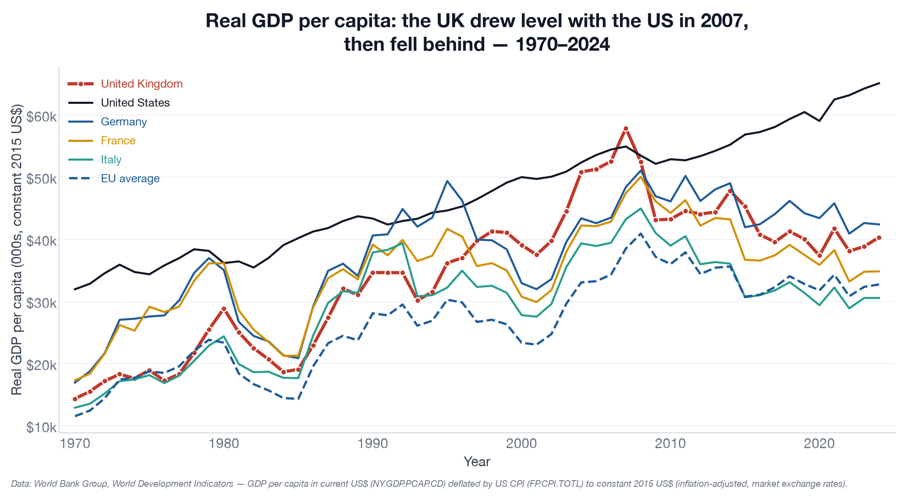
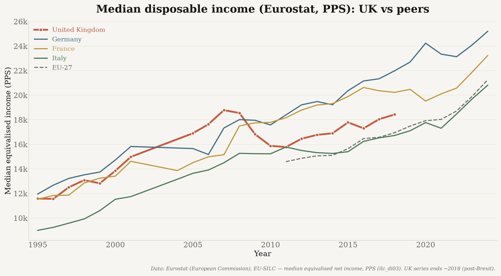
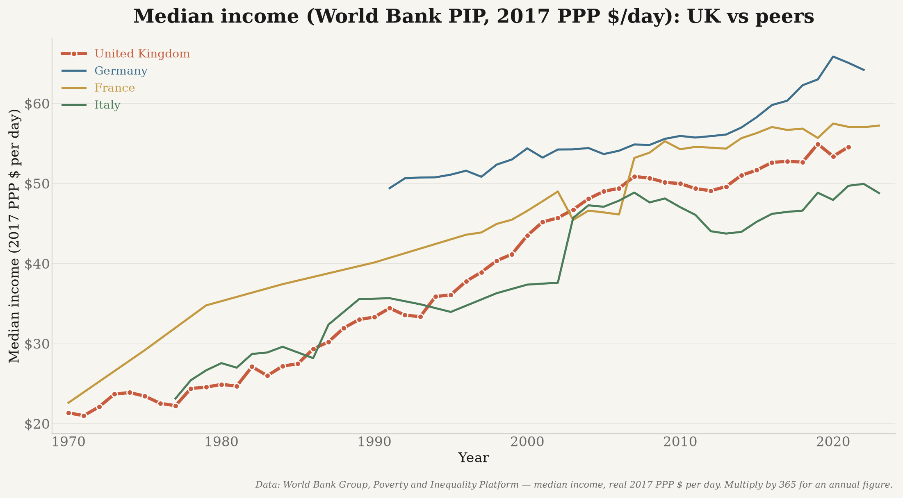

# europe_data — UK GDP per capita & median income (real)

Reproducible pipeline documenting the **UK's relative economic performance** vs. the US and
European peers, using **only real, publicly-sourced data** (every value is fetched live
from an official API — nothing is hand-entered, mocked, interpolated, or synthesized).

The headline GDP measure is **real GDP per capita in constant 2015 US$** — GDP per capita in
current US$ (World Bank `NY.GDP.PCAP.CD`) **deflated by US CPI** (`FP.CPI.TOTL`) to constant
2015 dollars. It is inflation-adjusted and at **market exchange rates** (not PPP), so it
reflects the actual dollar value of output each year with inflation removed. (PPP and the
World Bank fixed-exchange-rate series are also kept in the dataset for reference.)

## Headline results (figures in [`../outputs/`](../outputs))

### Real GDP per capita, 1970–2024 (constant 2015 US$)


The UK's real GDP per capita rose to **draw level with the US in 2007** (UK ≈ $57.9k vs US
≈ $54.9k, constant 2015 US$) — then **collapsed relative to the US**, falling to ~$40k by 2024
while the US climbed to ~$65k.
*Source: World Bank WDI `NY.GDP.PCAP.CD` deflated by US CPI (`FP.CPI.TOTL`) to constant 2015 US$
(inflation-adjusted, market exchange rates).*

### UK relative to its peers (US, Germany, France, EU average, Poland)


On a log scale (ratios span 45%→1100%): the UK **overtook the US in 2007 (105%)** then fell to
**62% by 2024**; it is roughly at parity with Germany (~95%) and above France; and it is being
**caught by Poland** — the UK went from ~11× Poland's GDP per capita to ~2× as Poland's
economy converged.

> **Which "constant US$"?** Two constructions exist: (a) *current US$ deflated by US CPI*
> (used here — preserves each year's actual exchange rate, so the strong 2007 pound shows up),
> and (b) World Bank `NY.GDP.PCAP.KD` (fixes the exchange rate at 2015, which erases the 2007
> crossover). We use (a) because it reflects the dollar value the UK economy actually reached.
> Note: in **PPP** terms Poland is ~85% of the UK (its lower price level makes market-FX
> understate it) — that series is in the dataset (`gdp_per_capita_ppp_*`).

### Median disposable income (a "typical household" measure)



*Sources: Eurostat `ilc_di03` (median equivalised net income, PPS; UK ends ~2018 post-Brexit);
World Bank Poverty & Inequality Platform (real median income, 2017 PPP $/day; UK to ~2021).*

## Data sources (all free, no API key — verified live)

| Metric (column) | Source & citation | Endpoint | Inflation basis |
|---|---|---|---|
| `gdp_per_capita_constant_usd` | **World Bank WDI** `NY.GDP.PCAP.KD` (**headline / plotted**) | `api.worldbank.org/v2/country/{iso3}/indicator/{id}` | **Real** — constant 2015 US$ (inflation-adjusted, market exchange rates) |
| `gdp_per_capita_nominal_usd` | **World Bank WDI** `NY.GDP.PCAP.CD` | (same) | Nominal — current US$ (reference: shows the exchange-rate driven 2007–08 UK≈US) |
| `gdp_per_capita_real_maddison` | **Maddison Project Database 2023** (Bolt & van Zanden), via Our World in Data | `ourworldindata.org/grapher/gdp-per-capita-maddison.csv?csvType=full` | Real — constant 2011 international $ (**PPP**); reference only |
| `gdp_per_capita_ppp_current` | **World Bank WDI** `NY.GDP.PCAP.PP.CD` | (same) | Nominal — current international $ (PPP); reference only |
| `gdp_per_capita_ppp_constant` | **World Bank WDI** `NY.GDP.PCAP.PP.KD` | (same) | Real — constant 2021 international $ (PPP); reference only |
| `median_disposable_income` / `mean_disposable_income` | **Eurostat** `ilc_di03` (`MED_EI`/`MEAN_EI`, `unit=PPS`) | `ec.europa.eu/eurostat/api/dissemination/…/ilc_di03` | Current PPS (cross-country comparable; **not** deflated over time) |
| `median_income_pip` | **World Bank PIP** (Poverty & Inequality Platform) | `api.worldbank.org/pip/v1/pip` | **Real** — constant 2017 PPP $ per day |


**Why constant US$ (not PPP)?** The headline series is World Bank `NY.GDP.PCAP.KD` — real GDP
per capita in **constant 2015 US$**, which is inflation-adjusted, uses market exchange rates
(not PPP), and covers **1960+**, so it reaches the 1970s directly. PPP series (Maddison; World
Bank PP.*) remain in the dataset for reference but can distort cross-country levels.

**Countries plotted:** United Kingdom (focus), **United States**, Germany, France, Italy.
(Spain is still fetched into the dataset but is not plotted.)

## Citations

Full citations for the organizations that collected/compiled each dataset (data accessed
**3 July 2026**):

- **World Bank** (2026). *World Development Indicators* — GDP per capita, constant 2015 US$
  (`NY.GDP.PCAP.KD`); GDP per capita, current US$ (`NY.GDP.PCAP.CD`); GDP per capita, PPP
  (`NY.GDP.PCAP.PP.CD`/`.KD`). Washington, DC: World Bank Group. Derived from World Bank
  national-accounts data and OECD National Accounts data files.
  <https://data.worldbank.org/indicator/NY.GDP.PCAP.KD>
- **World Bank** (2026). *Poverty and Inequality Platform (PIP)* — median income/consumption
  per capita (2017 PPP). Washington, DC: World Bank Group. Compiled from national household
  surveys. <https://pip.worldbank.org>
- **Eurostat (European Commission)** (2026). *Mean and median income by age and sex*
  (`ilc_di03`), EU Statistics on Income and Living Conditions (EU-SILC). Luxembourg: Eurostat.
  <https://ec.europa.eu/eurostat/databrowser/product/view/ilc_di03>
- **Maddison Project Database:** Bolt, Jutta and Jan Luiten van Zanden (2024). "Maddison-style
  estimates of the evolution of the world economy: A new 2023 update." *Journal of Economic
  Surveys.* Maddison Project Database, version 2023. Groningen Growth and Development Centre,
  University of Groningen. Retrieved via Our World in Data.
  <https://www.rug.nl/ggdc/historicaldevelopment/maddison/>

## Setup & usage

```bash
python3 -m venv .venv && ./.venv/bin/pip install -r ../requirements.txt

# Fetch all sources (default 1970..current) into ../data/ :
./.venv/bin/python -m europe_data.fetch_data --start 1970 --end 2024

# Render the figures into ../outputs/ :
./.venv/bin/python -m europe_data.plot_uk_decline
```

Outputs: per-source CSVs, `europe_combined_long.csv`, `europe_combined_wide.csv`, and
`manifest.json` in `../data/` (raw data git-ignored); four PNGs in `../outputs/`.

## Data integrity
Every plotted value traces to an official API. Spot-checked live (all exact matches): UK 2024
WDI constant-US$ & PPP GDP/cap, DE 2023 Eurostat median PPS, UK 2021 PIP median, and UK 1970
Maddison ($17,162). PIP is fetched with `fill_gaps=false` (real survey observations only); no
source performs interpolation or gap-filling.

## Modules
`countries.py` (curated countries + US peer + aggregates) · `worldbank.py` · `maddison.py` ·
`eurostat.py` · `pip.py` · `combine.py` · `_http.py`. Entry points: `-m europe_data.fetch_data`,
`-m europe_data.plot_uk_decline`. Tests: `../tests/test_pipeline.py`.
