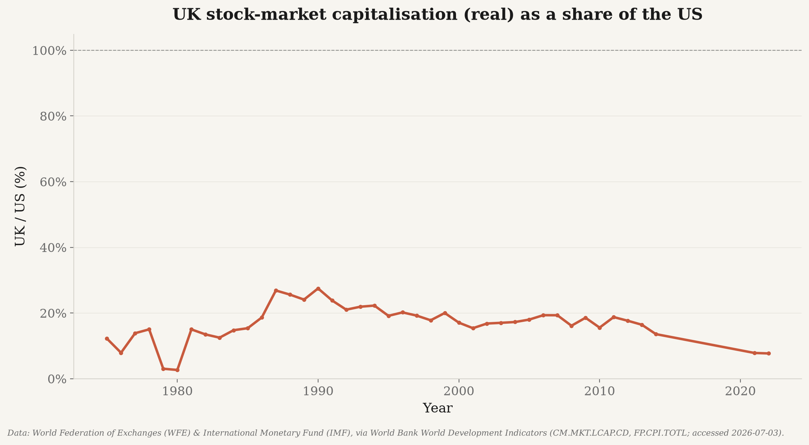

# markets_data — UK vs US stock-market size

Documents the relative decline of the UK stock market vs the US (with World / EU / Japan /
China for context), using **only real, publicly-sourced data** from the World Bank's World
Development Indicators (no API key).

## Headline results (figures in [`../outputs/stock_markets/`](../outputs/stock_markets))



The UK's listed-market capitalisation has fallen sharply relative to the US — from a peak of
~27% (1990) to ~8% by 2022. Charts cover market cap (nominal & real US$), market cap as a
share of GDP, and the number of listed domestic companies.

| File | Shows |
|---|---|
| `stock_market_cap_usd.png` / `_real.png` | Market cap, current US$ / constant 2024 US$ (CPI-deflated). |
| `stock_market_cap_pct_gdp.png` | Market cap as a share of GDP. |
| `stock_listed_domestic_companies.png` | Number of listed domestic companies. |
| `stock_uk_us_ratio_*` | UK-as-a-share-of-US variants of the above. |

## Data source & citation

- **World Bank** (2026). *World Development Indicators* — Market capitalization of listed
  domestic companies, current US$ (`CM.MKT.LCAP.CD`); % of GDP (`CM.MKT.LCAP.GD.ZS`); listed
  domestic companies (`CM.MKT.LDOM.NO`); US CPI (`FP.CPI.TOTL`, used to deflate to constant
  2024 US$). Washington, DC: World Bank Group. Underlying data compiled by the **World
  Federation of Exchanges** and **S&P Global**. Accessed 3 July 2026.
  <https://data.worldbank.org/indicator/CM.MKT.LCAP.CD>

Real figures are the nominal series deflated by US CPI to **constant 2024 US$** (market
exchange rates, not PPP). Series have tail-year gaps (the UK is missing after 2022); values
are never spliced or interpolated. Full per-metric citations are in
[`../outputs/stock_markets/stock_market_size_summary.md`](../outputs/stock_markets/stock_market_size_summary.md).

## Usage

```bash
python -m markets_data                 # fetch + combine + charts + summary (1975..current)
python -m markets_data --no-charts     # data only
```

Combined CSVs/manifest are written to `../data/` (git-ignored, regenerable); charts and the
trend summary are written to `../outputs/stock_markets/`.

## Modules
`markets.py` · `worldbank.py` · `regions.py` · `combine.py` · `charts.py` · `summary.py` ·
`paths.py` · `_http.py`. Entry point: `python -m markets_data`. Tests: `../tests/test_markets.py`.
