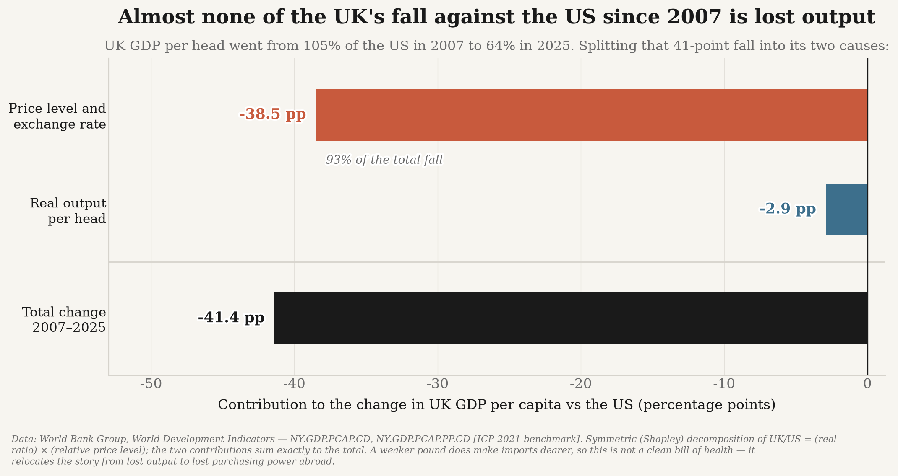
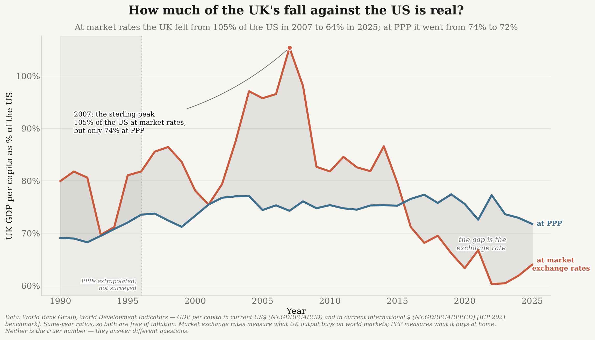
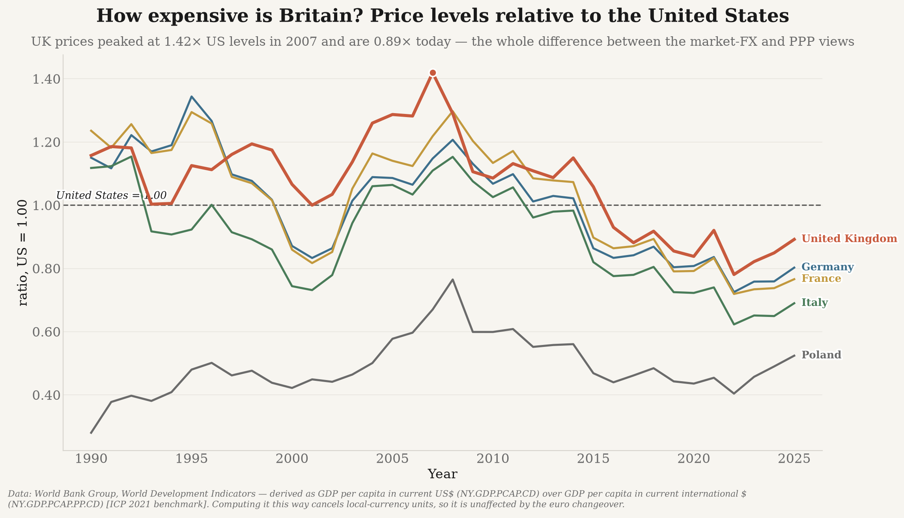
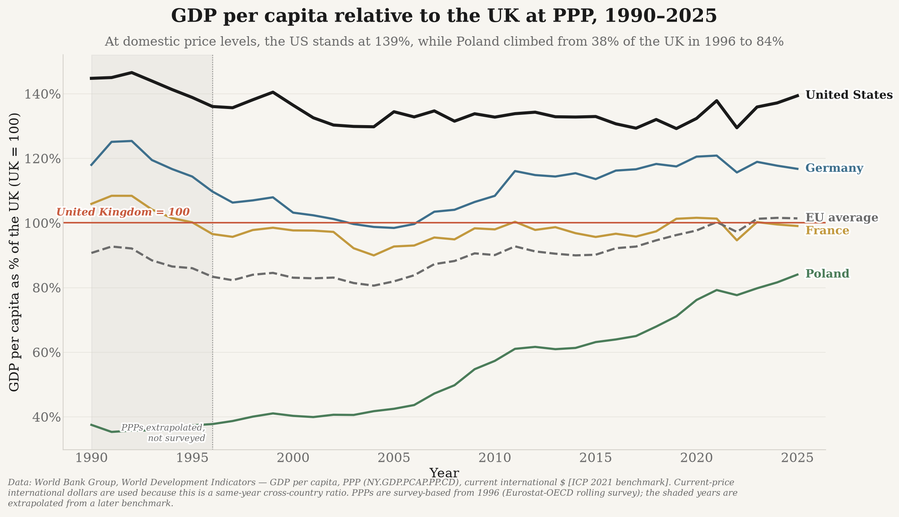
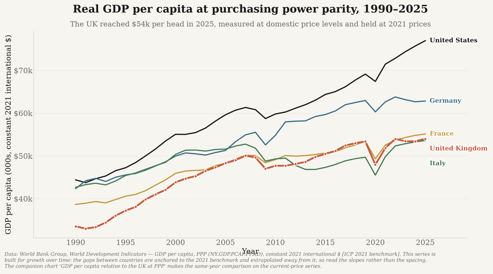
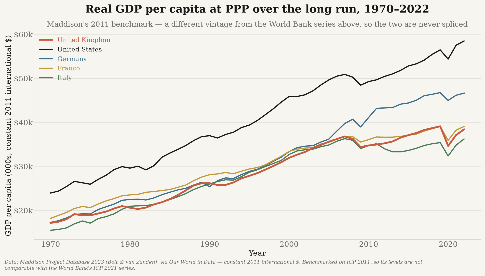
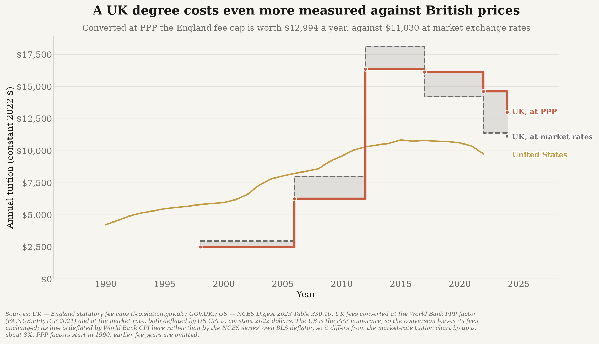
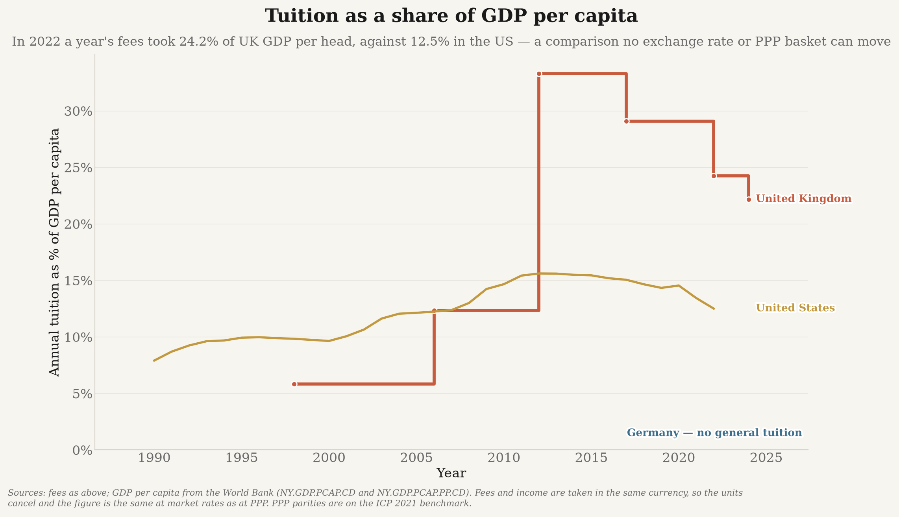

# ppp_data — the UK's decline measured at purchasing power parity

A **parallel** set of figures to this repository's headline charts. Everywhere else, money is
converted at **market exchange rates** and deflated to constant US dollars. Here it is
converted at **purchasing power parity** instead — and the two answers turn out to differ a
great deal.

> **This does not replace the headline view.** Market exchange rates measure what UK output
> buys *on world markets*; PPP measures what it buys *at home*. Neither is the truer number.
> The interesting quantity is the gap between them, which these figures isolate and measure.

All output lands in [`../outputs/ppp/`](../outputs/ppp). Run it with:

```bash
./.venv/bin/python -m ppp_data          # fetch -> validate -> CSVs -> figures
./.venv/bin/python -m ppp_data --from-csv   # re-chart without re-fetching
```

## Headline results

### Almost none of the UK's fall against the US is lost output


At market exchange rates the UK fell from **105% of US GDP per head in 2007 to 64% in 2025** —
the central fact of this repository's [GDP analysis](../europe_data/README.md). Decomposing
that 41-point fall:

| Contribution | Points |
|---|---|
| Relative real output per head (PPP volumes) | **−2.9** |
| Relative price level / exchange rate | **−38.5** |
| **Total** | **−41.4** |

**Roughly 93% of the measured decline against the US is the exchange rate and relative price
levels, not lost production.** At PPP the UK went from 74.3% of the US in 2007 to 71.8% in
2025 — a real slippage, but a small one.

This is a genuine qualification of the headline story, and it is reported as such. It is
*not* a clean bill of health: see [what this does and does not mean](#what-this-does-and-does-not-mean).

### The two views side by side


The shaded gap between the lines *is* the currency effect. The UK's 2007 "parity with the
US" was substantially a strong-pound artefact: in the same year, at PPP, the UK was only 74%
of the US.

### How expensive is Britain?


The price level index (how expensive a country is relative to the US, which is 1.00) is the
whole difference between the two views. UK prices peaked at **1.42× US levels in 2007** and
sit at **0.89× today** — sterling went from markedly over-valued to modestly under-valued
against PPP. (Conceptually this is the PPP conversion factor over the market exchange rate;
for why it is *computed* a different way, see [below](#deriving-the-price-level-index).)

### The peer comparison changes character


PPP **narrows** the UK's gap to the US and **widens** the convergence story with Poland:

| Peer, latest year | Share of the UK at market rates | at PPP |
|---|---|---|
| Poland | 49% | **84%** |
| Germany | 105% | **117%** |
| France | 85% | **99%** |

Poland is far closer to British living standards than dollar figures suggest, because Polish
prices are roughly half US levels. The catch-up is real on either measure — but on PPP it is
close to complete.

### Levels, and the long run



The World Bank's PPP series starts in 1990. The Maddison Project reaches back to 1970 but is
benchmarked on **2011** international dollars rather than the World Bank's 2021, so it gets
its own chart and is never spliced onto the World Bank line.

### Tuition



Here PPP moves the number the *other* way. Because UK prices are now below US prices, the
England fee cap is worth **more** in international dollars (~$12,990) than in market dollars
(~$11,030): measured against what a pound buys in Britain, a UK degree is dearer than the
headline chart implies.

The second figure sidesteps the currency question entirely. Tuition as a share of GDP per
capita is unit-free — the currency cancels, so the answer is identical at market rates and at
PPP. On that basis, in **2022** (the last year both fee series cover — the NCES US series
ends there) a year's fees took **24.2% of UK GDP per head against 12.5% in the US**. This is
the most robust affordability comparison available here, and it is the one that is least kind
to the UK.

## Method

### The identity everything rests on

For any country, GDP per capita converted at the market exchange rate and at PPP differ by
exactly one factor, the price level index:

```
GDPpc(current US$) = GDPpc(current int'l $) × PLI       PLI = PPP factor ÷ market FX
```

Taking a ratio against the United States (whose PLI is 1.00 by construction):

```
R_market_fx = R_ppp × R_price_level
```

so any change in the UK/US comparison is the product of a **real** change and a **price**
change. `ppp_data/decompose.py` splits it using the symmetric (Shapley) decomposition of a
two-factor product, which is exact and independent of which factor you vary first — there is
no arbitrary "hold X constant" choice biasing the result. The two contributions sum to the
total exactly, and the tests assert it.

### Which series is valid for which question

This is the easiest thing to get wrong, so it is enforced in code rather than left to
memory. Every metric in `ppp_data/metrics.py` declares whether it is valid as a level over
time, as a same-year cross-country ratio, or neither; `require_over_time` and
`require_cross_section` raise if a chart asks for the wrong one.

| Series | Level over time | Same-year ratio | Why |
|---|---|---|---|
| `NY.GDP.PCAP.PP.KD` (constant 2021 int'l $) | ✅ | ❌ | Inflation removed, but extrapolated from the 2021 benchmark with each country's own deflator, so cross-country levels drift away from 2021 |
| `NY.GDP.PCAP.PP.CD` (current int'l $) | ❌ | ✅ | Correct for a same-year comparison; carries worldwide inflation, so a rising line would partly be rising prices |
| `price_level_index` | ✅ | ✅ | A unit-free ratio |
| `gdp_per_capita_real_maddison` (2011 int'l $) | ✅ | ❌ | A different ICP vintage; own chart only |

### Deriving the price level index

The index is derived as **`NY.GDP.PCAP.CD ÷ NY.GDP.PCAP.PP.CD`**, not as the more obvious
`PA.NUS.PPP ÷ PA.NUS.FCRF`. Both are algebraically the same quantity, but in the first the
country's local-currency GDP cancels, so the result is immune to redenominations.

That matters, and it was found by the validation rather than assumed: **for euro-area
countries before 1999 the World Bank quotes `PA.NUS.PPP` in euro but `PA.NUS.FCRF` in the
legacy national currency.** The direct ratio is then wrong by the legacy conversion rate —
for Italy in the 1990s, by a factor of nearly 2,000, producing a "price level" of 0.0005.

Both routes are computed. The direct one is kept as `price_level_index_direct`, is flagged
`validation_only` so it can never be plotted, and exists purely so that
`validate.check_price_level_agreement` can confirm the headline index from two entirely
independent pairs of World Bank series. The 27 country-years where they legitimately
disagree are enumerated in `validate.CURRENCY_BASIS_BREAKS`; a disagreement anywhere else
fails the run.

## Validation

`python -m ppp_data` runs eleven checks and **refuses to write figures if any fails at error
level**. This is the answer to "do these PPP numbers actually make sense?":

| Check | What it would catch |
|---|---|
| `no_duplicates` | Double-counting on re-fetch |
| `coverage` | A plotted country silently missing its series |
| `sources_present` | An unattributed row |
| `us_is_numeraire` | US price level index ≠ 1.00 — the numeraire misidentified |
| `price_level_agreement` | The two independent routes disagreeing: wrong series, misaligned years, or a currency-basis break |
| `benchmark_year_agreement` | Constant- and current-price PPP ratios diverging in the ICP benchmark year |
| `plausible_ranges` | Order-of-magnitude errors, misplaced decimals, wrong indicator |
| `relative_price_levels` | An inverted index (Poland must be cheaper than the UK) |
| `ppp_beats_market_fx_for_poland` | The two conversion bases swapped |
| `metric_units` | A constant-price series written out under a current-price label |
| `spot_values` | A large upstream revision moving well-known published values |

A representative passing run:

```
[PASS] us_is_numeraire: US price level index over 36 years; furthest from 1.00 is 1.000000000
[PASS] price_level_agreement: checked 216 country-years; worst agreeing error 0.17% (POL 1993);
       27 disagreement(s) explained by a documented currency changeover
[PASS] benchmark_year_agreement: UK/US PPP ratio in 2021: 0.7256 (current prices) vs 0.7256
       (constant 2021 prices), differing by 0.00%
```

## Caveats

| # | Hazard | How it is handled |
|---|---|---|
| A | Current international $ embed worldwide inflation | Barred from level charts by `require_over_time`; enforced by test |
| B | **ICP benchmark revisions** (2011 → 2017 → 2021) shift levels *retroactively* | Vintages are never spliced; every figure names its vintage in the source note. Figures here are **not** comparable with PPP numbers published under an earlier round |
| C | Maddison uses the 2011 benchmark | Its own chart; never joined to a World Bank line |
| D | World Bank PPP starts in 1990 | PPP charts start in 1990 and say so; Maddison covers the earlier period separately |
| E | Constant-int'l-$ levels are only strictly benchmarked in 2021 | Cross-country ratios use the current-price series instead; documented above |
| F | **PPP is not "the truth", it is a different question** | Every figure that could be read as "the real number" shows both bases or carries the framing line; the single-basis figures (price levels, the Maddison long run, the share-of-income chart) say in their own note what basis they are on |
| G | PPP-converting equity market cap is meaningless | Stock markets excluded — see below |
| H | Eurostat **PPS** (EU27 = 100) ≠ World Bank **international $** (US-referenced) | Never plotted on the same axis |
| I | The EU row is a PPP-weighted aggregate, not a country | Labelled "EU average"; excluded from FX/price-level lookups, which need a single currency |
| J | Sterling's 2008/2016/2022 swings | Isolated and measured — this is what the price-level and decomposition charts are *for* |
| K | Tuition mixes a *specific* price with an *economy-wide* PPP basket | Footnoted, and paired with the basket-free share-of-GDP chart |
| L | Missing years and country gaps | No interpolation, forward-filling, or splicing — the observation is dropped |
| M | `PA.NUS.PPP` and `PA.NUS.FCRF` share a currency basis only after the euro changeover | The index is derived by a route where currency units cancel; the direct route is validation-only |

### Why stock markets are excluded

`markets_data` is deliberately **not** given a PPP twin. Equity market capitalisation is the
value of claims on globally-traded cash flows, priced by international investors in market
currency. Deflating it by a domestic consumption-basket PPP would answer no meaningful
question — an investor selling UK shares receives dollars at the market rate, not at PPP.
This matches the existing caveat in `markets_data/markets.py`.

The same reasoning excludes tax-to-GDP, London's share of UK GDP, and the NHS, rail, crime,
age, trust, and migration analyses: they are ratios, rates, or counts, where the currency has
already cancelled and PPP has nothing to contribute.

### What this does and does not mean

The decomposition says the UK produces almost as much per head, relative to the US, as it did
in 2007 — the collapse is in what that output is worth in dollars. That is a **real** loss,
not an accounting illusion:

- Imports, foreign travel, overseas assets, and dollar-priced energy all genuinely cost more.
- A country that pays world prices for tradables **is** poorer when its currency falls, even
  if domestic production is unchanged.
- The UK's terms of trade deteriorated; PPP is designed to remove exactly that effect.

So the honest reading is that the PPP view **relocates** the story rather than refuting it:
from *"Britain stopped producing"* to *"Britain's output lost value against the rest of the
world, and its people lost purchasing power abroad."* Meanwhile the measures where the
currency cancels entirely — tuition as a share of income, and Poland's convergence — still
point the same way as the headline analyses.

## Sources

All free, no API key, fetched live. Data accessed via the World Bank API; see
`data/ppp_manifest.json` for the exact run.

- **World Bank** (2026). *World Development Indicators.* Washington, DC: World Bank Group.
  - `NY.GDP.PCAP.PP.KD` — GDP per capita, PPP (constant 2021 international $)
  - `NY.GDP.PCAP.PP.CD` — GDP per capita, PPP (current international $)
  - `NY.GDP.PCAP.CD` — GDP per capita (current US$)
  - `PA.NUS.PPP` — PPP conversion factor, GDP (LCU per international $)
  - `PA.NUS.FCRF` — Official exchange rate (LCU per US$, period average)
  - `FP.CPI.TOTL` — Consumer price index (US, used as the deflator)

  PPP estimates derive from the **International Comparison Program (ICP)**, 2021 round.
  <https://data.worldbank.org/indicator/NY.GDP.PCAP.PP.KD>
- **Bolt, J. & van Zanden, J. L.** (2024). *Maddison Project Database 2023*, via Our World in
  Data. Real GDP per capita in constant 2011 international $.
  <https://ourworldindata.org/grapher/gdp-per-capita-maddison>
- **Tuition:** England statutory fee caps (legislation.gov.uk / GOV.UK); NCES *Digest of
  Education Statistics 2023*, Table 330.10. Read from
  `data/processed/tuition_history.csv`, built by [`../tuition`](../tuition/README.md).

## Layout

```
ppp_data/
  metrics.py       metric registry: units, ICP vintage, per-metric validity + caveats
  peers.py         which countries are plotted, and in what colour
  worldbank.py     World Bank client + the two derived price level indices
  maddison.py      long-run PPP series (re-labelled from europe_data.maddison)
  series.py        slicing tidy rows into per-country series and ratios
  decompose.py     the symmetric real-vs-price-level decomposition
  validate.py      the eleven sanity checks
  combine.py       long/wide CSVs + manifest
  figure.py        shared chart helpers (wrapped notes, non-colliding end labels)
  charts.py        the six GDP and price-level figures
  tuition_ppp.py   the two tuition figures
  __main__.py      fetch -> validate -> combine -> chart
```

Tests: `tests/test_ppp.py` (47 tests, fully offline).
