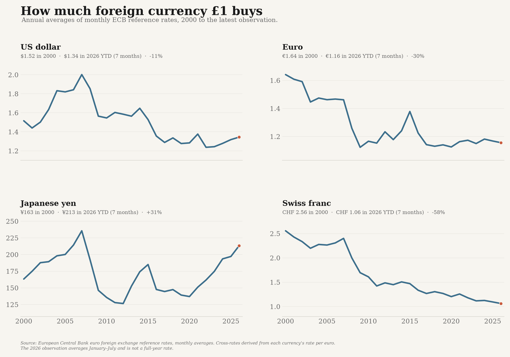

# sterling_data — the value of the pound against major currencies



This analysis shows how much foreign currency **£1 buys** against the US dollar, euro,
Japanese yen, and Swiss franc from 2000 through the latest available month.

The panels use actual exchange-rate units rather than an index, so each can be read
directly: for example, `$1.30` means one pound buys 1.30 US dollars. The header on each
panel also reports the percentage change since 2000.

## Source and method

The source is the **European Central Bank's official euro foreign exchange reference
rate API**, monthly average series:

`EXR/M.USD+JPY+CHF+GBP.EUR.SP00.A`

The ECB publishes currency units per euro. Pound cross-rates are derived without
interpolation:

- USD/GBP = USD/EUR ÷ GBP/EUR
- EUR/GBP = 1 ÷ GBP/EUR
- JPY/GBP = JPY/EUR ÷ GBP/EUR
- CHF/GBP = CHF/EUR ÷ GBP/EUR

Annual values average the available monthly pound cross-rates. The latest 2026 value
is explicitly labelled year-to-date because the API currently runs through July.

## Run

```bash
./.venv/bin/python -m sterling_data
./.venv/bin/python -m sterling_data --from-csv data/sterling_exchange_rates.csv
./.venv/bin/pytest tests/test_sterling.py -q
```

