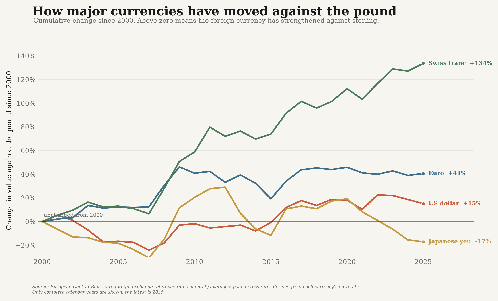

# sterling_data — the value of the pound against major currencies



This analysis compares how much foreign currency **£1 buys** against the US dollar,
euro, Japanese yen, and Swiss franc from 2000 through the latest complete year.

All four currencies are shown as the **percentage change in their value against the
pound since 2000**. Positive values mean the foreign currency strengthened against
sterling; negative values mean it weakened.

## Source and method

The source is the **European Central Bank's official euro foreign exchange reference
rate API**, monthly average series:

`EXR/M.USD+JPY+CHF+GBP.EUR.SP00.A`

The ECB publishes currency units per euro. Pound cross-rates are derived without
interpolation:

- USD/GBP = USD/EUR ÷ GBP/EUR
- EUR/GBP = 1 ÷ GBP/EUR
- JPY/GBP = JPY/EUR ÷ GBP/EUR
- CHF/GBP = CHF/EUR ÷ GBP/EUR

Annual values average the twelve monthly pound cross-rates. Partial years are excluded,
so the current chart ends in **2025**.

## Run

```bash
./.venv/bin/python -m sterling_data
./.venv/bin/python -m sterling_data --from-csv data/sterling_exchange_rates.csv
./.venv/bin/pytest tests/test_sterling.py -q
```
