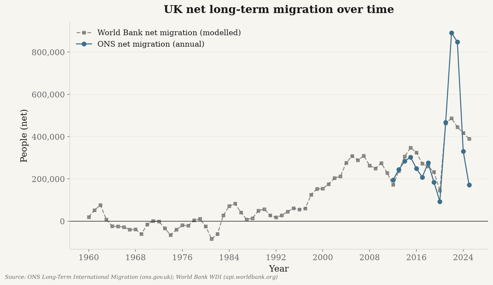

# uk_migration — UK immigration over time (legal + irregular)

Fetches and charts UK migration flows over time — immigration, emigration, net migration,
visas by category, asylum, and irregular arrivals — using **only real, publicly-sourced
data**. No values are hand-entered, interpolated, or synthesised; each traces to a source
below (full list in [`../outputs/migration/SOURCES.md`](../outputs/migration/SOURCES.md)).

## Headline results (figures in [`../outputs/migration/`](../outputs/migration))



| File | Shows |
|---|---|
| `net_migration.png` / `net_migration_per_capita.png` | Net long-term migration, total and per-capita. |
| `immigration_vs_emigration.png` | Inflows vs outflows over time. |
| `immigration_by_origin.png` / `net_migration_by_origin.png` | Flows by citizenship/origin. |
| `visas_by_category.png` | Entry-clearance visas by category (Home Office). |
| `asylum_applications.png` | Asylum applications over time. |
| `irregular_arrivals.png` / `legal_vs_irregular.png` | Irregular arrivals (incl. small boats) vs legal routes. |

## Data sources & citations

- **Office for National Statistics (ONS)** — Long-Term International Migration
  (immigration, emigration, net migration), incl. the 1964–2015 IPS-by-citizenship series.
- **UK Home Office** — Immigration System Statistics (visas, asylum, irregular arrivals).
- **World Bank** — World Development Indicators for `GBR` (`SM.POP.NETM`, `SP.POP.TOTL`, etc.),
  used for population denominators.

`*_per_1000_pop` / per-capita series are **derived** (flow ÷ World Bank population × 1000).
Migration figures are headcounts, so no CPI/inflation adjustment applies. Full citations
with URLs: [`../outputs/migration/SOURCES.md`](../outputs/migration/SOURCES.md).

## Usage

```bash
python -m uk_migration.run                 # fetch + chart -> ../outputs/migration/
python -m uk_migration.run --no-charts     # data only
```

Raw/intermediate data lands in `../data/` (git-ignored); charts and `SOURCES.md` in
`../outputs/migration/`.

## Modules
`run.py` (CLI) · `combine.py` · `normalize.py` · `charts.py` · `schema.py` · `_aggregate.py` ·
`_govuk.py` · `_spreadsheet.py` · `_http.py`. Tests: `../tests/` (`test_uk_migration`, etc.).
